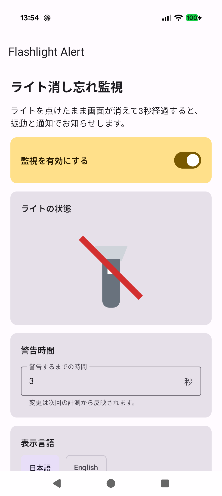

# Flashlight Alert

Flashlight Alertは、Androidスマートフォンのライトが点灯したまま端末が非操作になった場合に、設定時間の経過後に通知するアプリです。

## スクリーンショット

<p align="center">
  
</p>

## ダウンロード

最新の署名済みAPKは [Releases](https://github.com/nao-dev-space/flashlight-alert-releases/releases) からダウンロードしてください。

各リリースでは、次の2ファイルを配布します。

- `Flashlight-Alert-vX.Y.Z.apk`: インストール用APK
- `SHA256SUMS.txt`: APKが正規の配布物と一致することを確認するためのSHA-256

GitHubが自動表示する「Source code」は、この配布リポジトリのREADMEとプライバシーポリシーだけを含み、Androidアプリのソースコードは含みません。

## インストール

1. [Releases](https://github.com/nao-dev-space/flashlight-alert-releases/releases) からAPKをAndroid端末へダウンロードします。
2. Androidの案内に従い、ダウンロードに使用したブラウザーまたはファイル管理アプリについて「不明なアプリのインストール」を許可します。
3. APKを開いてインストールします。
4. インストール後、「不明なアプリのインストール」の許可を無効に戻すことを推奨します。
5. Flashlight Alertを開き、通知権限を許可します。アプリからライトを操作する場合は、カメラ権限も許可します。

Google Play外からの配布であるため、自動更新はありません。更新版が公開された場合は、新しいAPKをダウンロードして上書きインストールしてください。

## 正規性の確認

### APKファイル全体のSHA-256

次のPowerShellコマンドは、ダウンロードしたAPKファイル全体のSHA-256を計算し、`SHA256SUMS.txt`に記載された値と比較します。この値はAPKの内容が変わるたびに変化します。

Windows PowerShellでは、APKと`SHA256SUMS.txt`を同じフォルダーへ保存し、次を実行します。

```powershell
$checksumEntry = (Get-Content -LiteralPath '.\SHA256SUMS.txt' | Select-Object -First 1) -split '\s+', 2
$expectedHash = $checksumEntry[0].ToLowerInvariant()
$apkFileName = $checksumEntry[1]
$actualHash = (Get-FileHash -LiteralPath ".\$apkFileName" -Algorithm SHA256).Hash.ToLowerInvariant()
[pscustomobject]@{
    File = $apkFileName
    Expected = $expectedHash
    Actual = $actualHash
    Matches = ($actualHash -eq $expectedHash)
} | Format-List
```

`Matches`が`True`であれば、APKは公開時のファイルと一致しています。`False`と表示された場合やファイルが見つからないエラーになった場合は、APKをインストールせず、同じリリースからAPKと`SHA256SUMS.txt`を再ダウンロードしてください。

### 署名証明書のSHA-256

次の値はAPKファイル全体ではなく、APKへ署名した開発者の証明書に対するSHA-256です。PowerShellで表示される`Expected`および`Actual`とは計算対象が異なるため、値が異なるのが正常です。同じ署名鍵を使用している限り、APKを更新してもこの値は変わりません。

正式なAPKの署名証明書SHA-256は次の値です。

```text
9b9e138855aae66c82ced3aec00914f090c5c361c5660861fe042dfb9cbc16dc
```

## プライバシー

本アプリは外部通信、広告、分析、クラウド保存を行いません。詳細は[プライバシーポリシー](PRIVACY.md)を参照してください。

## 問い合わせ

不具合は、このリポジトリの[Issues](https://github.com/nao-dev-space/flashlight-alert-releases/issues)で報告してください。報告にはパスワード、個人情報、その他の秘密情報を記載しないでください。

## ソースコードと再配布

Androidアプリのソースコードは公開していません。本リポジトリにオープンソースライセンスは付与していません。APK、文書、画像その他の内容について、明示的に許可していない複製、改変、再配布を許可しません。

Copyright (c) 2026 nao-dev-space. All rights reserved.
